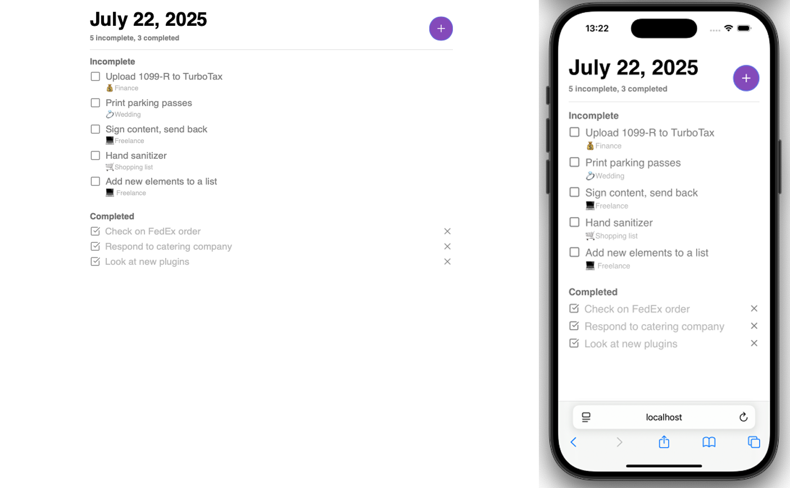

# 📝 1/100 — To-Do App

Минималистичное, но масштабируемое приложение для управления задачами. Реализовано в рамках челленджа **"100 проектов"**.

Сфокусировано на продуктивности без избыточности. Стартовая точка для быстрых и чистых фронтенд-проектов.

---

## 🚀 Технологический стек

- **Frontend**: React + TypeScript
- **Стилизация**: SCSS-модули
- **Иконки**: [Lucide](https://lucide.dev/)
- **Состояние**: локальный `localStorage` 
- **Бандлер**: Vite

---

## ⚙️ Функциональность

- ✅ Добавление / удаление / выполнение задач
- ✏️ Редактирование заголовка и описания задачи inline
- 🔍 Фильтрация: выполненные / невыполненные
- ⏳ Анимация смены состояния чекбокса с задержкой в 500 мс
- 📱 Адаптивный интерфейс

---

## 🚀 Быстрый старт

```bash
# 1. Клонируй репозиторий
git clone https://github.com/dmitrychervochkin/1-to-do-app.git

# 2. Перейди в папку проекта
cd 1-to-do-app

# 3. Установи зависимости
npm install

# 4. Запусти в dev-режиме
npm run dev
```
 
